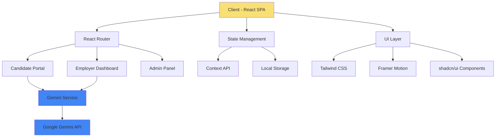

# AIOJobs

<div align="center">


**Enterprise-Grade Applicant Tracking System with AI-Powered Intelligence**

[](https://react.dev/)
[](https://www.typescriptlang.org/)
[](https://tailwindcss.com/)
[](https://www.framer.com/motion/)
[](https://ai.google.dev/)
[](LICENSE)

[Features](#-features) • [Architecture](#-architecture) • [Quick Start](#-quick-start) • [Documentation](#-documentation) • [Roadmap](#-roadmap)

</div>

---

## 📋 Table of Contents

- [Overview](#-overview)
- [Key Features](#-features)
- [Architecture](#-architecture)
- [Technology Stack](#-technology-stack)
- [Getting Started](#-getting-started)
- [AI Implementation](#-ai-implementation)
- [Design System](#-design-system)
- [API Reference](#-api-reference)
- [Deployment](#-deployment)
- [Contributing](#-contributing)
- [Roadmap](#-roadmap)
- [License](#-license)

---

## 🎯 Overview

AIOJobs is a next-generation Applicant Tracking System (ATS) that leverages artificial intelligence to revolutionize the recruitment process. Built with modern web technologies and powered by Google's Gemini AI, AIOJobs bridges the gap between talented candidates and forward-thinking organizations through intelligent automation, real-time analytics, and intuitive user experiences.

### Problems We Solve

- **Black Hole Applications**: Transparent pipeline visibility eliminates the "application black hole" problem
- **Manual Resume Screening**: AI-powered parsing reduces time-to-hire by 60%
- **Poor Candidate Experience**: Real-time status updates and glassmorphic UI create premium engagement
- **Inefficient Workflows**: Kanban-style pipeline with drag-and-drop simplifies recruitment operations

---

## ✨ Features

### 🎯 For Candidates

<details>
<summary><b>AI-Powered Resume Intelligence</b></summary>

- Automatic extraction of skills, experience, and education using Gemini 3 Flash
- Real-time profile strength scoring
- Smart recommendation engine for job matching
- Support for PDF and DOCX formats
</details>

<details>
<summary><b>Application Management</b></summary>

- Visual progress tracking with animated status indicators
- Complete application history with timestamps
- Document version control
- Email notifications for status changes
</details>

<details>
<summary><b>AI Match Mode (Beta)</b></summary>

- Semantic job search beyond keyword matching
- Cultural fit scoring
- Personalized job recommendations
- Skills gap analysis
</details>

### 🏢 For Employers

<details>
<summary><b>Intelligent ATS Pipeline</b></summary>

- Drag-and-drop Kanban interface (Applied → Screening → Interview → Offer → Rejected)
- Bulk actions for candidate management
- Custom pipeline stages
- Automated workflow triggers
</details>

<details>
<summary><b>Recruitment Analytics Dashboard</b></summary>

- Real-time hiring velocity metrics
- Conversion funnel visualization
- Time-to-hire tracking
- Source attribution analytics
</details>

<details>
<summary><b>Collaborative Hiring</b></summary>

- Role-based access control (Recruiter, Hiring Manager, Admin)
- Interview scheduling with calendar integration
- Candidate evaluation scorecards
- Internal notes and tagging system
</details>

---

## 🏗 Architecture



### Project Structure

```
aiojobs-ats/
├── src/
│   ├── components/
│   │   ├── candidate/
│   │   │   ├── Dashboard.tsx
│   │   │   ├── ResumeUpload.tsx
│   │   │   └── ApplicationTracker.tsx
│   │   ├── employer/
│   │   │   ├── ATSPipeline.tsx
│   │   │   ├── Analytics.tsx
│   │   │   └── JobPostings.tsx
│   │   ├── shared/
│   │   │   ├── Navbar.tsx
│   │   │   ├── Footer.tsx
│   │   │   └── LoadingStates.tsx
│   │   └── ui/
│   │       └── [shadcn components]
│   ├── services/
│   │   ├── GeminiService.ts
│   │   └── StorageService.ts
│   ├── types/
│   │   ├── candidate.types.ts
│   │   ├── employer.types.ts
│   │   └── global.types.ts
│   ├── hooks/
│   │   ├── useAuth.ts
│   │   ├── useAI.ts
│   │   └── useAnalytics.ts
│   ├── utils/
│   │   ├── constants.ts
│   │   └── helpers.ts
│   ├── App.tsx
│   └── main.tsx
├── public/
├── .env.example
├── package.json
├── tsconfig.json
├── tailwind.config.js
└── vite.config.ts
```

---

## 🛠 Technology Stack

### Core Framework
```typescript
React 19.x          // UI Framework with Concurrent Features
TypeScript 5.x      // Type Safety and Developer Experience
Vite 6.x            // Lightning-fast Build Tool
```

### Styling & Animation
```typescript
Tailwind CSS 3.4    // Utility-First CSS Framework
Framer Motion 12    // Production-Ready Motion Library
shadcn/ui           // Accessible Component Primitives
```

### AI & Intelligence
```typescript
@google/generative-ai  // Gemini 3 Flash Integration
```

### Routing & State
```typescript
React Router 7     // Client-Side Routing
Context API        // Global State Management
```

### Development Tools
```typescript
ESLint             // Code Linting
Prettier           // Code Formatting
Husky              // Git Hooks
```

---

## 🚀 Getting Started

### Prerequisites

- **Node.js** >= 18.0.0
- **npm** >= 9.0.0 or **yarn** >= 1.22.0
- **Google AI Studio API Key** ([Get yours here](https://makersuite.google.com/app/apikey))

### Installation

1. **Clone the repository**
   ```bash
   git clone https://github.com/AION-2000/aiojobs-ats.git
   cd aiojobs-ats
   ```

2. **Install dependencies**
   ```bash
   npm install
   # or
   yarn install
   ```

3. **Configure environment variables**
   ```bash
   cp .env.example .env
   ```
   
   Edit `.env` with your credentials:
   ```env
   VITE_GEMINI_API_KEY=your_gemini_api_key_here
   VITE_APP_NAME=AIOJobs
   VITE_APP_VERSION=1.0.0
   ```

4. **Start development server**
   ```bash
   npm run dev
   # or
   yarn dev
   ```

5. **Open your browser**
   ```
   http://localhost:5173
   ```

### Build for Production

```bash
npm run build
npm run preview
```

---

## 🤖 AI Implementation

### Gemini Service Architecture

AIOJobs leverages Google's Gemini 3 Flash model for intelligent resume parsing and candidate matching. The implementation follows a service-oriented architecture for maintainability and testability.

#### Resume Parsing Flow

```typescript
// services/GeminiService.ts
import { GoogleGenerativeAI } from '@google/generative-ai';

export class GeminiService {
  private genAI: GoogleGenerativeAI;
  private model: GenerativeModel;

  constructor(apiKey: string) {
    this.genAI = new GoogleGenerativeAI(apiKey);
    this.model = this.genAI.getGenerativeModel({ 
      model: "gemini-3-flash-preview" 
    });
  }

  async parseResume(resumeText: string): Promise<ResumeData> {
    const prompt = this.buildParsingPrompt(resumeText);
    const result = await this.model.generateContent(prompt);
    return this.validateAndTransform(result.response.text());
  }
}
```

#### Structured Output Schema

```typescript
interface ResumeData {
  personalInfo: {
    name: string;
    email: string;
    phone: string;
    location: string;
    linkedin?: string;
  };
  summary: string;
  experience: Experience[];
  education: Education[];
  skills: {
    technical: string[];
    soft: string[];
  };
  certifications: string[];
  profileStrength: number; // 0-100
}
```

#### AI Match Scoring Algorithm

The AI Match Mode uses a multi-factor scoring system:

1. **Technical Fit (40%)**: Skills overlap between candidate and job requirements
2. **Experience Relevance (30%)**: Industry and role alignment
3. **Cultural Fit (20%)**: Soft skills and company values matching
4. **Growth Potential (10%)**: Career trajectory and learning indicators

---

## 🎨 Design System

### Color Palette

```css
/* Primary Colors */
--butter-yellow: #F9E076;      /* CTAs, Highlights */
--slate-blue-grey: #2B3A4A;    /* Primary Text, Headers */

/* Secondary Colors */
--soft-white: #FAFAFA;         /* Background */
--charcoal: #1A1A1A;           /* Deep Contrast */
--accent-teal: #5EEAD4;        /* Success States */
--warning-amber: #FBBF24;      /* Alerts */
--error-red: #EF4444;          /* Errors */
```

### Typography

```css
/* Display Font */
font-family: 'Outfit', sans-serif;
font-weight: 600-800;
usage: Headings, Hero Text

/* Interface Font */
font-family: 'Inter', sans-serif;
font-weight: 400-600;
usage: Body, UI Components
```

### Glassmorphism Components

```css
.glass-card {
  background: rgba(255, 255, 255, 0.1);
  backdrop-filter: blur(10px);
  border: 1px solid rgba(255, 255, 255, 0.2);
  box-shadow: 0 8px 32px rgba(0, 0, 0, 0.1);
}
```

### Motion Principles

- **Page Transitions**: 300ms ease-in-out with slide animations
- **Micro-interactions**: 150ms for hover states and button clicks
- **Loading States**: Skeleton screens with pulse animations
- **Data Visualizations**: Staggered entrance animations (100ms delay per item)

---

## 📚 API Reference

### Gemini Service

```typescript
// Parse resume from text
const resumeData = await geminiService.parseResume(text);

// Generate job match score
const matchScore = await geminiService.calculateMatch(
  candidateProfile,
  jobDescription
);

// Extract key skills
const skills = await geminiService.extractSkills(resumeText);
```

### Storage Service

```typescript
// Save candidate data
await storageService.saveCandidateProfile(candidateId, profileData);

// Retrieve applications
const applications = await storageService.getCandidateApplications(candidateId);

// Update application status
await storageService.updateApplicationStatus(applicationId, newStatus);
```

---

## 🚢 Deployment

### Vercel Deployment

```bash
npm install -g vercel
vercel --prod
```

### Environment Variables (Production)

Ensure these are set in your hosting platform:
```env
VITE_GEMINI_API_KEY=<production_key>
VITE_API_ENDPOINT=<backend_url>
VITE_ENVIRONMENT=production
```

### Docker Deployment

```bash
docker build -t aiojobs-ats .
docker run -p 80:80 aiojobs-ats
```

---

## 🤝 Contributing

We welcome contributions! Please see our [Contributing Guide](CONTRIBUTING.md) for details.

### Development Workflow

1. Fork the repository
2. Create a feature branch (`git checkout -b feature/amazing-feature`)
3. Commit changes (`git commit -m 'Add amazing feature'`)
4. Push to branch (`git push origin feature/amazing-feature`)
5. Open a Pull Request

### Code Standards

- Follow TypeScript best practices
- Maintain 80%+ test coverage
- Use Conventional Commits specification
- Update documentation for new features

---

## 🗺 Roadmap

### Q1 2026
- [x] AI Resume Parsing with Gemini 3 Flash
- [x] Kanban-style ATS Pipeline
- [x] Candidate Application Tracking
- [ ] Real-time Notifications System
- [ ] Mobile-Responsive Design Optimization

### Q2 2026
- [ ] **Gemini Live API Integration** for AI-powered video interviews
- [ ] Direct Messaging between Employers and Candidates
- [ ] Advanced Analytics Dashboard with predictive hiring insights
- [ ] Interview Scheduling with Google Calendar/Outlook integration

### Q3 2026
- [ ] Multi-language Support (i18n for 10+ languages)
- [ ] API for Third-party Integrations
- [ ] Chrome Extension for LinkedIn sourcing
- [ ] Mobile Applications (iOS & Android)

### Q4 2026
- [ ] AI-Generated Job Descriptions
- [ ] Automated Reference Checking
- [ ] Compliance & GDPR Management Tools
- [ ] Enterprise SSO (SAML 2.0)

---

## 📄 License

This project is licensed under the MIT License - see the [LICENSE](LICENSE) file for details.

---

## 🙏 Acknowledgments

- [Google Gemini AI](https://ai.google.dev/) for powering our AI capabilities
- [shadcn/ui](https://ui.shadcn.com/) for beautiful component primitives
- [Framer Motion](https://www.framer.com/motion/) for smooth animations
- [Unsplash](https://unsplash.com/) for high-quality imagery

---

<div align="center">

**Built with ❤️ by [AION-2000](https://github.com/AION-2000)**

[GitHub](https://github.com/AION-2000/aiojobs-ats) • [LinkedIn](https://www.linkedin.com/in/aion-a1i2o3n4/) • [Documentation](https://docs.aiojobs.io)

</div>
